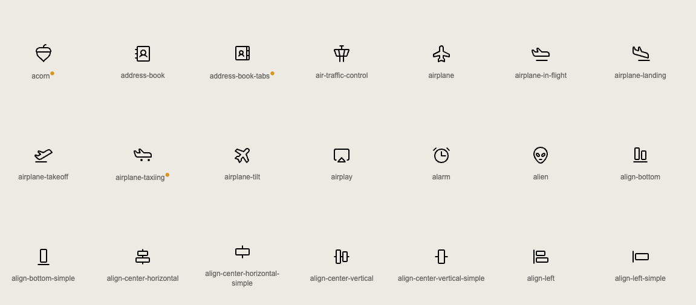

# Phosphor Templ Icons



This project provides a collection of [Phosphor Icons](https://phosphoricons.com/) wrapped as templ components for easy
use in Go-based web applications. Each icon is available as a reusable component, generated with `templ` version
**v0.3.819**, ensuring compatibility with the latest templ features.

## Features

- **Lightweight**: Each icon is rendered as an inline SVG, minimizing the need for external assets.
- **Customizable**: Modify size, variant, and other attributes directly via the `Props` struct.
- **Comprehensive**: Includes the full set of Phosphor Icons, with consistent support for all variants (e.g., `thin`,
  `light`, `bold`, `duotone`).

## Installation

1. Install the `templ` command-line tool:
   ```bash
   go install github.com/a-h/templ/cmd/templ@v0.3.819
   ```
2. Add this module to your project:
   ```bash
   go get github.com/iota-uz/icons
   ```

## Usage

### Adding Icons

Import the `icons` package and use the provided templ components with the `Props` struct for customization.

```templ
package main

import (
    icons "github.com/iota-uz/icons/phosphor"
)

templ Page() {
  <html>
    <body>
      <h1>Example Page</h1>
      @icons.ArrowArcLeft(icons.Props{
        Variant: icons.DuoTone,
        Size:    "24",
        Class:   "rotate",
      })
      @icons.IconHeart(icons.Props{
        Variant: icons.Bold,
        Size:    "32",
        Class:   "icon-heart",
      })
    </body>
  </html>
}
```

### Props Struct

Use the `Props` struct to customize icons. The struct includes:

- **`Size`**: The size of the icon (e.g., `"24"`, `"48"`).
- **`Class`** *(optional)*: Additional CSS classes to apply to the icon.
- **`Variant`**: The style of the icon. Options:
    - `Regular`
    - `Filled`
    - `DuoTone`
    - `Thin`
    - `Bold`
    - `Light`
- **`Attributes`** *(optional)*: A `templ.Attributes` map for further customization.

### Example: Custom Attributes

```templ
@icons.IconArrowRight(icons.Props{
  Variant: icons.Filled,
  Size:    "32",
  Class:   "navigate-icon",
  Attributes: templ.Attributes{
    "data-action": "navigate",
  },
})
```

## Development

This project includes a `cmd/generate/main.go` script to transform icons downloaded from the Phosphor Icons website into templ
components.

### Makefile Commands

The project includes a `Makefile` to streamline common tasks.

#### **`make download`**
Downloads the Phosphor Icons ZIP file and extracts it into the `phosphor-icons` directory.

```bash
make download
```

#### **`make generate`**
Runs the Go script to transform the icons into templ components, formats the files, and generates Go code.

```bash
make generate
```

#### **`make clean`**
Removes the `phosphor-icons` directory and any temporary or generated files.

```bash
make clean
```

#### **`make`**
Runs both `download` and `generate` targets in sequence.

```bash
make
```

## License

This project is licensed under the MIT License. See the `LICENSE` file for more details.
